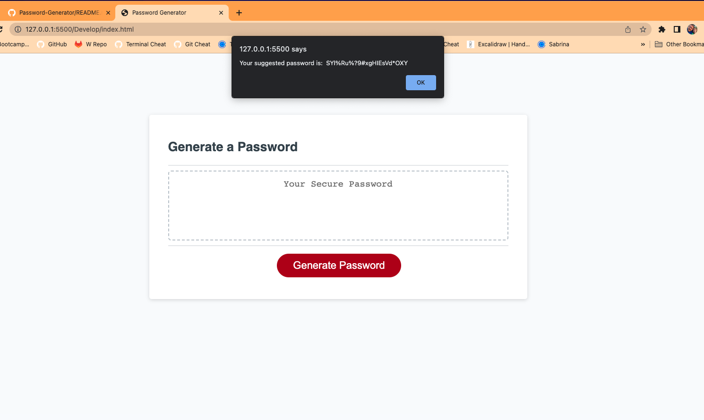

SUMMARY:
  Passwords made from random characters are hard to remember. A password phrase (consisting of several words) can be a strong password if it has enough words in it. This program generates a suggested password phrase that should be much more memorable than a password made from random characters. 

  Relevant XKCD comic: [https://xkcd.com/936/]

HOW TO USE: 
  Open main.html in your browser

DEPLOYED LINK:   
https://noctiluca-scintillans.github.io/PhraseGenerator/
  
SCREENSHOT:

